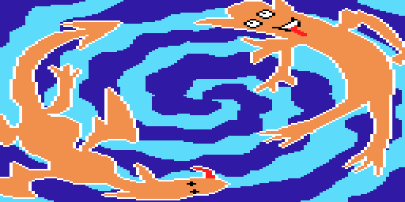
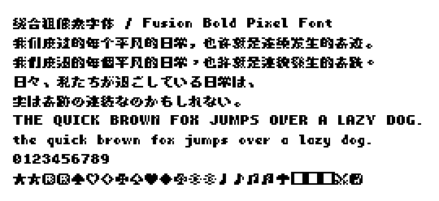
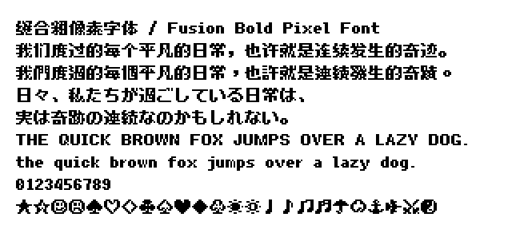
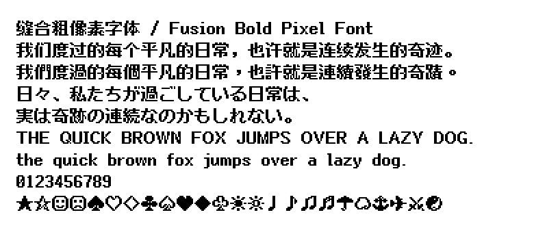
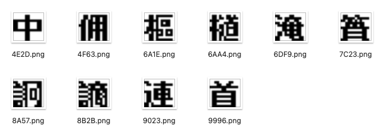
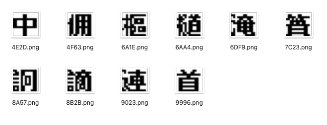

# 缝合粗像素字体 / Fusion Bold Pixel Font

[](LICENSE-OFL)
[](LICENSE-MIT)
[](https://github.com/pixel-font-studio/fusion-bold-pixel-font/releases)
[](https://discord.gg/3GKtPKtjdU)
[](https://qm.qq.com/q/jPk8sSitUI)

[「缝合像素字体」](https://github.com/TakWolf/fusion-pixel-font) 的算法粗体版本，黑体风格。

> [!WARNING]
> 
> 这不是一个正式项目，仅用于测试，旨在提供思路和验证概念。
> 

## 预览

### 8 像素



### 10 像素



### 12 像素



## 算法

算法思路可以参考[《无用教程 - 游戏汉化时使用的像素字体》](https://sndream.github.io/pixel/pixel-fonts-used-in-chinese.html) 中「字重」小结。

算法分为「右移重叠」和「左移重叠」两种模式。两种思路其实一样，只是移动方向不同，导致镂空方向有区别，观感效果是相似的。

本项目采用「右移重叠」方案。

「右移重叠」效果：



```python
bitmap = MonoBitmap.load_png(file_path)
solid_bitmap = bitmap.resize(left=1).plus(bitmap)
shadow_bitmap = solid_bitmap.minus(bitmap).resize(left=1)
result_bitmap = solid_bitmap.minus(shadow_bitmap)
```

「左移重叠」效果：



```python
bitmap = MonoBitmap.load_png(file_path)
solid_bitmap = bitmap.resize(right=1).plus(bitmap, x=1)
shadow_bitmap = solid_bitmap.minus(bitmap, x=1).resize(left=-1)
result_bitmap = solid_bitmap.minus(shadow_bitmap)
```

变换后，字形尺寸高度不变，宽度会增加 1px，即：

```text
8px * 8px -> 8px * 9px
10px * 10px -> 10px * 11px
12px * 12px -> 12px * 13px
```

此时，等宽模式将不再对齐（原始为 6px * 2 = 12px，变换后变为 7px * 2 != 13px，差 1px）。

## 笔者观点

你能看到任何一种算法，生成的字形都不完美。

这只是一个在没有粗体情况下的妥协方案，本人并不推荐。

如果可能，你应该优先去尝试经过良好设计过的粗体，例如 [x8y12pxDenkiChip](https://github.com/hicchicc/x8y12pxDenkiChip)。

## 许可证

请参考：[缝合像素字体 - 许可证](https://github.com/TakWolf/fusion-pixel-font?tab=readme-ov-file#%E8%AE%B8%E5%8F%AF%E8%AF%81)
